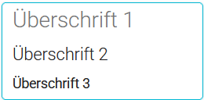
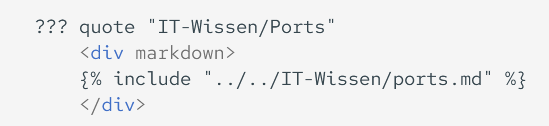

# MkDocs / Formatierung

## Überschriften

!!! info ""
    { align=left}
    ```
        # Überschrift 1
        ## Überschrift 2
        ### Überschrift 3
    ```

## Infoboxen

!!! info ""
    !!! note inline "Hinweis"
        Text
    ```
    !!! note "Hinweis"
        Text
    ```    

!!! info ""
    !!! abstract inline "Abstract"
        Text
    ```
    !!! abstract "Abstract"
        Text
    ```

!!! info ""
    !!! info inline "Info"
        Text
    ```
    !!! info "Info"
        Text
    ```    

!!! info ""
    !!! tip inline "Tipp"
        Text
    ```
    !!! tip "TIPP"
        Text
    ```

!!! info ""
    !!! success inline "Erfolg"
        Text
    ```
    !!! success "Erfolg"
        Text
    ```    

!!! info ""
    !!! question inline "Frage"
        Text
    ```
    !!! question "Frage"
        Text
    ```

!!! info ""
    !!! warning inline "Warnung"
        Text
    ```
    !!! warning "Warnung"
        Text
    ```    

!!! info ""
    !!! failure inline "Versagen"
        Text
    ```
    !!! failure "Versagen"
        Text
    ```
    
!!! info ""
    !!! danger inline "Gefahr"
        Text
    ```
    !!! danger "Gefahr"
        Text
    ```    

!!! info ""
    !!! bug inline "Bug"
        Text
    ```
    !!! bug "Bug"
        Text
    ```

!!! info ""
    !!! example inline "Beispiel"
        Text
    ```
    !!! example "Beispiel"
        Text
    ```    

!!! info ""
    !!! quote inline "Zitat"
        Text
    ```
    !!! quote "Zitat"
        Text
    ```

!!! info ""
    !!! info inline ""
        Ohne Boxbeschreibung
    ```
    !!! info ""
        Ohne Boxbeschreibung
    ```

!!! info ""
    ??? info inline "Ausklappbar"
        Text
    ```
    ??? info "Ausklappbar"
        Text
    ```

!!! info ""
    ???+ info inline "Ausklappbar"
        Ausklapbar voreingest. ausgeklappt
    ```
    ???+ info "Ausklappbar"
        Ausklappbar voreingest. ausgeklappt
    ```


## Tabelle
| Überschrift 1 | Überschrift 2 |
|---|---|
| Inhalt Spalte 1 | Inhalt Spalte 2 |
| Inhalt Spalte 1 | Inhalt Spalte 2 |

| Links | Zentriert | Rechts |
| :---- | :----: | ----: |
| Text links | Text zentriert | Text rechts |


## Horizontale Linie
!!! info ""
    !!! info inline "Horizontale Linie"
        ---
    ```
        ---
    ```


## Icon's
!!! info ""
    !!! info inline "Icon's"
        [:simple-materialformkdocs: MkDocs-Icon's](https://squidfunk.github.io/mkdocs-material/reference/icons-emojis/){: target="_blank" }

        :beers: 
        :soccer: 
        :simple-youtube: 
        :simple-materialformkdocs:
    ```
        :beers: 
        :soccer: 
        :simple-youtube: 
        :simple-materialformkdocs:
    ```


## Images
!!! info ""
    !!! info inline "Bilder externe Adresse"
        { align=left, width="300" }
    ```
        { align=left, width="300" }
    ```

!!! info ""
    !!! info inline "Bilder interne Adresse"
        { align=left, width="300" }
    ``` html
        { align=left, width="300" }
    ```


## Spalten
<div style="display: flex; gap: 1em; padding-bottom: 1em;" markdown>
<div class="spalten2-div" style="background-color: #64fa91ff;" markdown="1">
*Linke Spalte* 

- Liste  
- Tabelle  
- Code  
  </div>
<div class="spalten2-div" style="flex: 1;  background-color: #f8a50966; border-radius: 5px; padding: 1em;" markdown="1">
*Rechte Spalte*

> Zitat  

**Fett**  
</div>
</div>


## Include
!!! info ""
    ??? quote inline "IT-Wissen/Ports" 
        <div markdown>
        
        </div>
    { align=left, width=60%}


